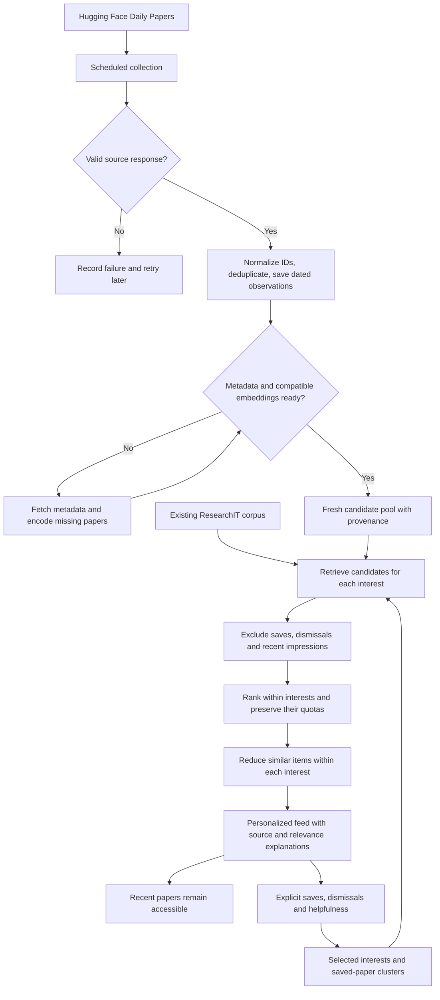
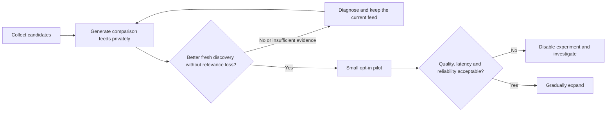

# Hugging Face → ResearchIT: integration plan

Status: first shadow milestone implemented locally, September 25, 2026. The adapter, persistent collection worker, local candidate preparation and comparison are built and tested;
Hugging Face candidates are **not connected to the serving feed**. Current code
and local test results do not establish the state of the deployed app.

## The idea

Hugging Face helps discover papers. ResearchIT decides which papers fit each
reader. Collecting candidates happens on a schedule, outside page requests, so
an external outage does not prevent a reader from opening their feed.

The diagram is a proposed logical structure, not a literal trace of current
functions. Recent-impression eligibility must also constrain candidate retrieval
where supported, so ranking has enough unseen candidates. Explicit saves and
dismissals stay excluded even when an exhausted pool permits labelled repeats.
Failed/incomplete ingestion uses bounded retries; it must never spin indefinitely.

## What exists and what remains

| Layer | Status | Next work |
|---|---|---|
| HF source adapter | Built and tested locally | Verify runtime access; it currently fails from this environment |
| Scheduled collection and dated storage | Implemented locally | Deploy a single worker with durable storage; runtime network check blocked |
| Candidate readiness | Local shadow vectors implemented | Verify real BGE-M3 runtime; production indexing remains separate |
| Interest clusters, quota, heuristic, diversity | Existing local engine | Reuse and evaluate with the expanded pool |
| HF-enriched personalized feed | Not enabled; offline comparison implemented | Human-judge real candidates before a pilot |
| Trend momentum | Not implemented | Repeated observations, normalized growth and source confidence |
| Video explanations | Later | Reviewed paper-to-video links and separate helpfulness feedback |

## How a paper reaches someone

Illustrative example: a new paper about model evaluation appears on Hugging
Face. ResearchIT records its real publication date and source observation time,
resolves its arXiv ID, and fetches missing metadata and embeddings. A reader who
saved evaluation papers may receive it; a reader interested only in robotics
should not receive it merely because it is popular.

If the item is a model announcement without a verified paper, keep it labelled
as a model release. Do not invent an arXiv paper or imply every announcement
will appear on Hugging Face Daily Papers.

## Rollout flow

1. **Collect:** save timestamped source observations, retain zero-vote papers,
   deduplicate, and track ready versus incomplete candidates. Keep fetching out
   of interactive page requests. Mark stale snapshots and expire their trend
   claims; use bounded retries and an ordinary-feed fallback.
2. **Compare privately:** run current, HF-only, and combined candidate strategies
   on the same reader briefs and dated snapshots. HF-only is a diagnostic
   baseline, not the proposed product. Reviewers judge without seeing which
   system produced the ranking. Keep the final evaluation period untouched.
3. **Pilot:** experiment with up to two or three eligible HF-sourced papers in
   a ten-paper page. This is a cap to test, not a required quota or a proven
   optimum. Interest balance remains the governing constraint. Fill unused
   slots with ordinary relevant candidates.
4. **Expand only with evidence:** measure useful new discoveries, relevance by
   interest, source coverage, refresh repetition, response latency and outages.
   Keep the ability to disable the experiment immediately.

## What the tests must establish

| Question | Test |
|---|---|
| Can a new zero-citation paper enter? | Trace discovery → ready candidate → relevant reader feed |
| Does popularity overpower taste? | Include a viral off-topic paper and verify it does not crowd out useful matches |
| Do smaller interests survive? | Inspect page-one representation and judged relevance for each interest |
| Is the vector model helping? | Real semantic queries, stored-vector health, exact/ANN comparison, dense/keyword/hybrid ablations |
| Does refresh remain useful? | Multiple refreshes with relevance and unseen-share measurements |
| Can the source fail safely? | Timeout, rate limit, malformed response, stale snapshot and incomplete embedding scenarios |
| Is an improvement credible? | Blinded human judgments and chronological holdout; no votes used as user-specific gold labels |

Existing algorithm tests are useful foundations. Real embeddings, complete
source access and independent relevance judgments remain necessary before a
quality claim. See the separate audit dashboard for executed results and gaps.

## Should we eventually stop using Hugging Face?

Separate **where we discover papers** from **how we rank them**. ResearchIT can
learn preferences from its own feedback while still using HF and other sources
for new content. A trained model cannot know tomorrow's releases without fresh
input. Reduce or remove HF only after a source-removal experiment preserves
fresh coverage and reader usefulness. Keep independent publication sources so
HF's AI-community selection does not define the whole research universe.

## Next concrete milestone

Implemented collection, timestamped local storage, bounded preparation and a
side-by-side comparison command. See [operations instructions](../../docs/HF-DISCOVERY-OPERATIONS.md).
Next: run on reachable services with durable storage and judge real outputs.
No production ingestion, model training or serving deployment was performed.
